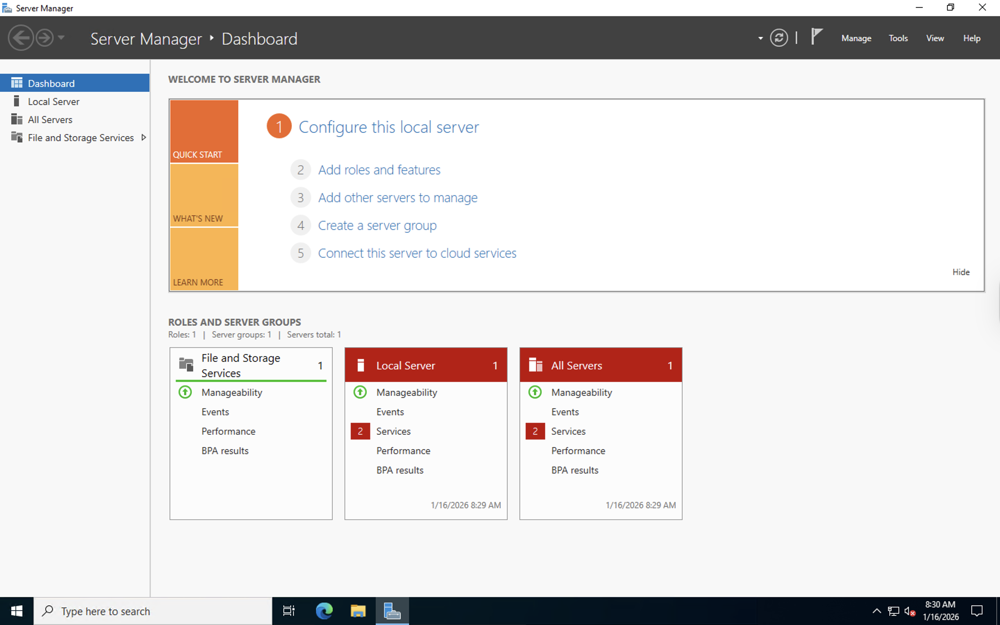
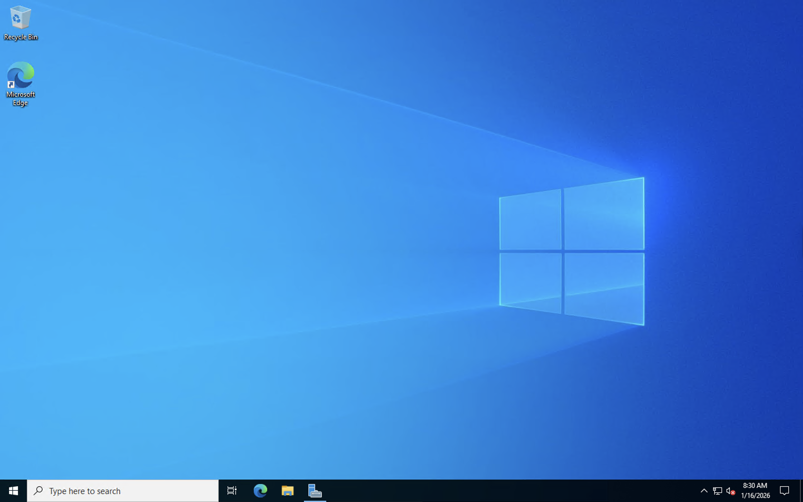
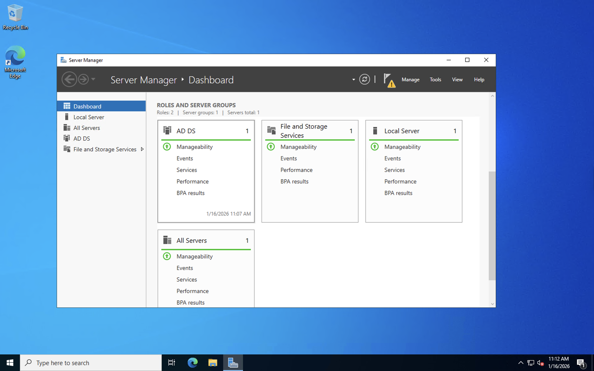
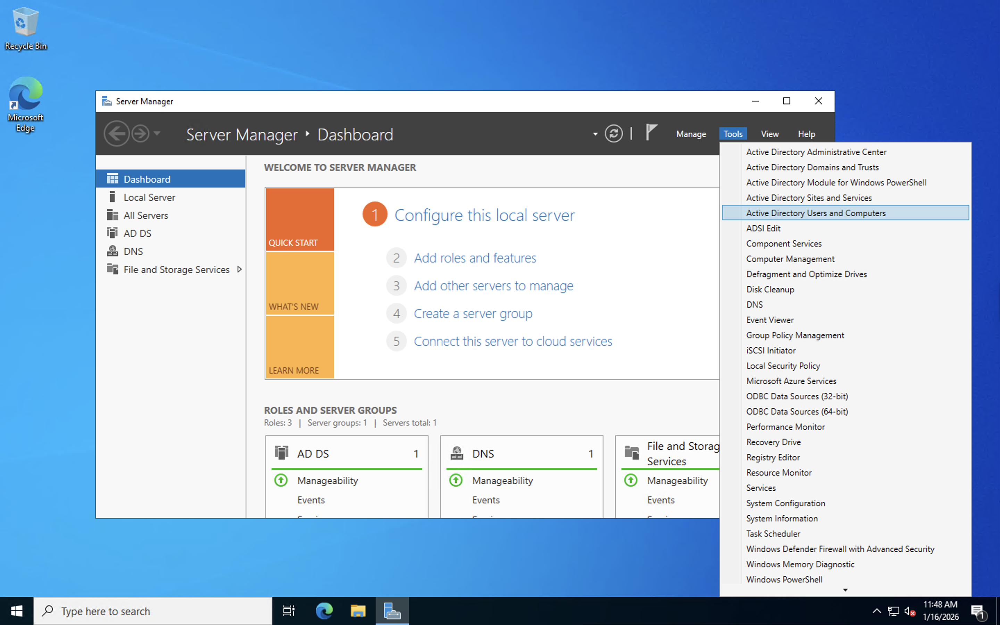
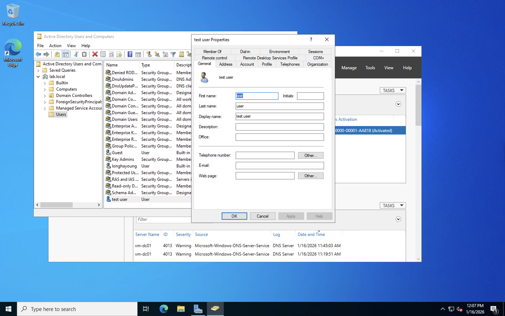
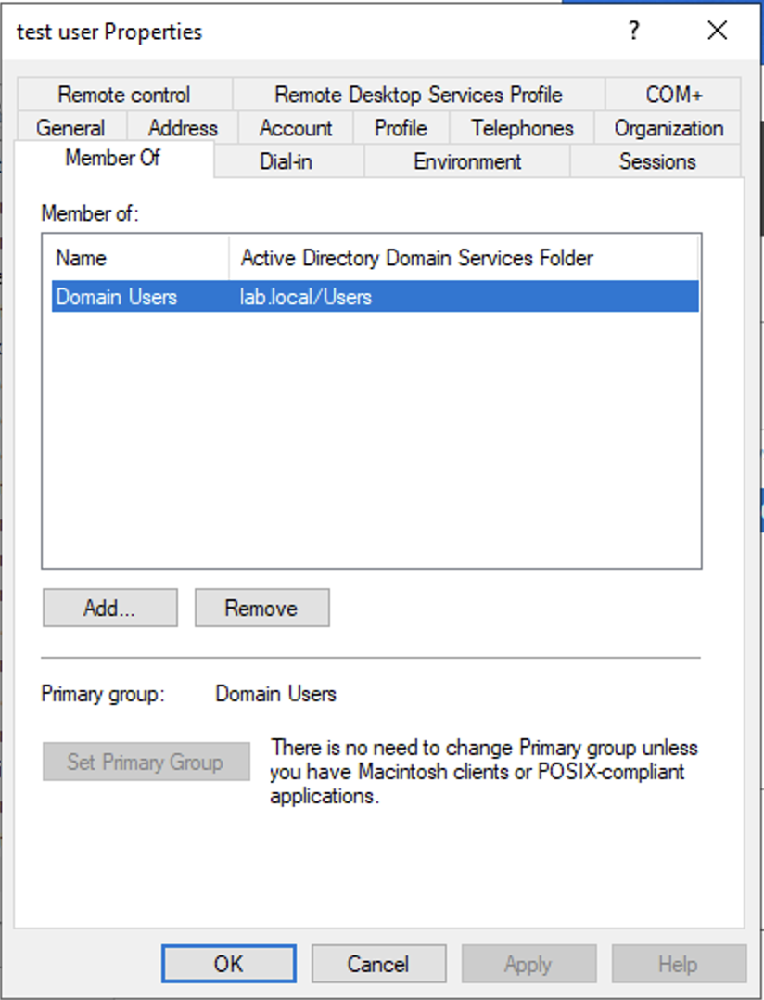
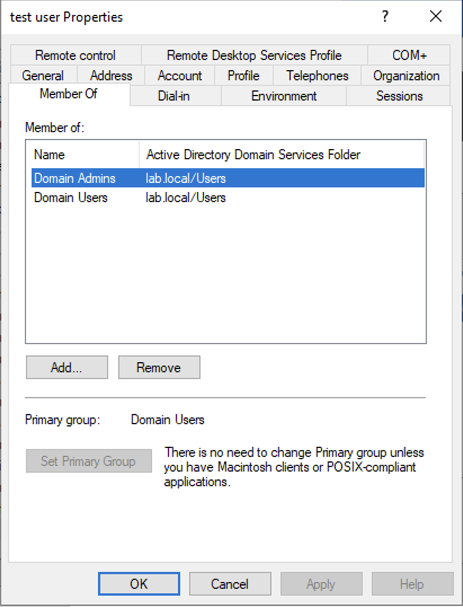
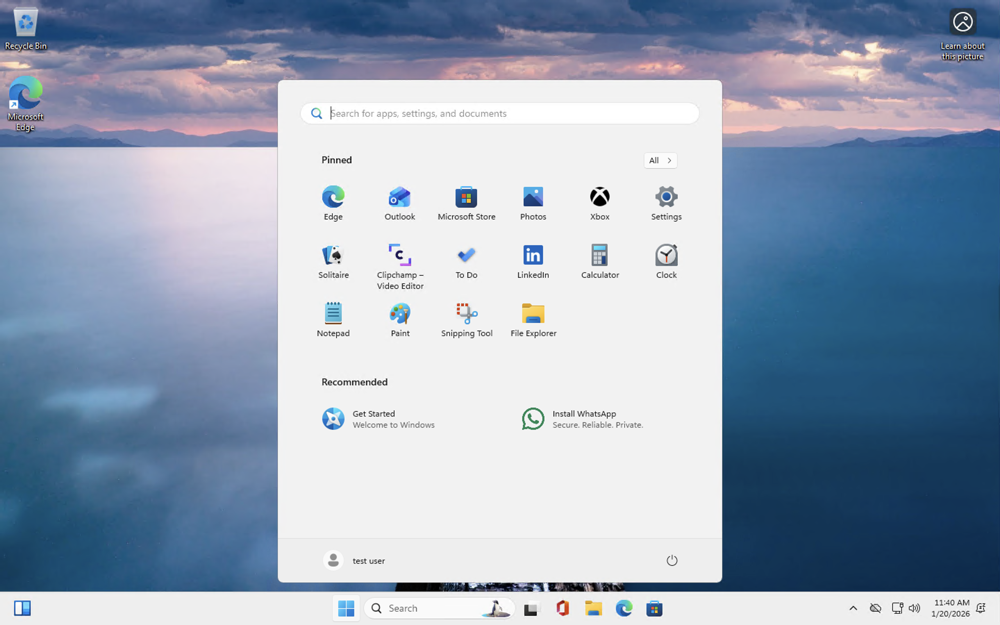
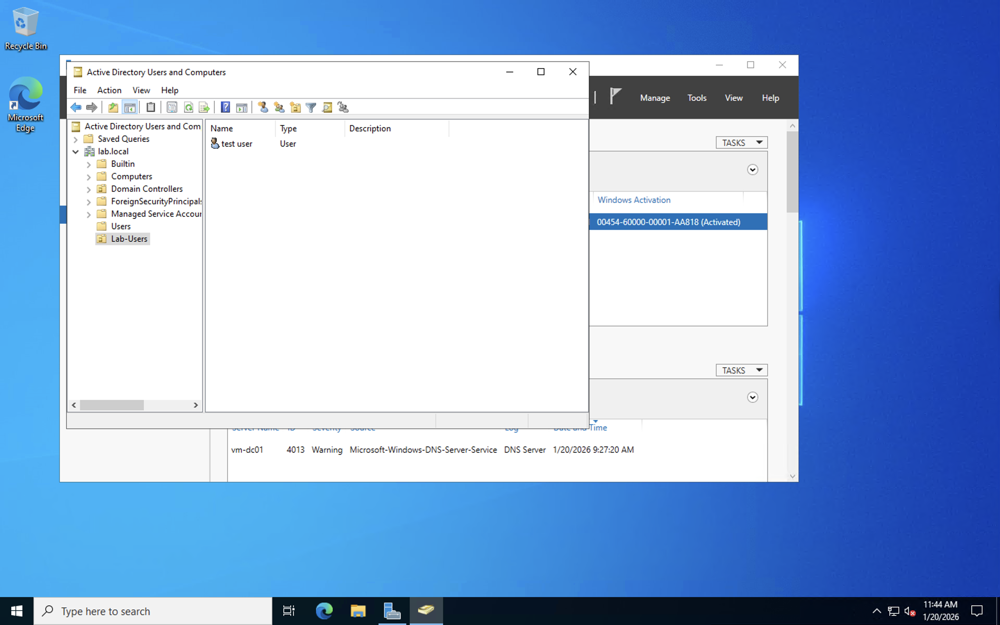

# Active Directory Home Lab (Azure)

## Overview
This home lab demonstrates how to deploy and configure a basic on-premises Active Directory environment using a Windows Server virtual machine in Microsoft Azure.

The purpose of this lab is to gain hands-on experience with Active Directory Domain Services (AD DS), user and group management, and domain-based authentication.

---

## Environment
- Cloud Platform: Microsoft Azure
- Operating System: Windows Server
- Services Installed:
  - Active Directory Domain Services (AD DS)
  - DNS
- Domain Name: `lab.local`

---

## Lab Architecture
- One Windows Server VM acting as:
  - Domain Controller
  - DNS Server
- One domain user used for authentication testing

---

## Steps Performed

### 1. Initial VM Deployment
A Windows Server virtual machine was created in Azure and accessed via Remote Desktop Protocol (RDP).  
After the first login, the default Windows Server desktop environment was confirmed.

---

### 2. Server Manager – Initial State
After logging in, **Server Manager** automatically opened.  
At this stage, no Active Directory roles were installed yet, and the server was still a standalone system.

This step confirms the baseline state before any role configuration.

---

### 3. Installing AD DS and DNS Roles
Using **Server Manager**, the following roles were installed:
- Active Directory Domain Services (AD DS)
- DNS Server

These roles are required to promote the server into a Domain Controller.

---

### 4. Promoting the Server to Domain Controller
After installing AD DS, the server was promoted to a Domain Controller.  
A new forest was created with the domain name `lab.local`.

This process configured the server as the central authentication authority for the domain.

---

### 5. Accessing Active Directory Users and Computers
The **Active Directory Users and Computers (ADUC)** console was opened from Server Manager.  
This tool is used to manage users, groups, and organizational units within the domain.

---

### 6. Creating a Domain User
A new domain user named **test user** was created inside the domain.  
This account was used to verify domain-based authentication and permission handling.

---

### 7. Verifying Default Group Membership
The properties of the newly created user were reviewed.  
By default, the user was a member of the **Domain Users** group, which provides standard domain access.

---

### 8. Adding User to Domain Admins
For testing and administrative verification, the user was added to the **Domain Admins** group.

This step demonstrates how administrative privileges are assigned using group membership in Active Directory.

---

### 9. Domain Login Verification
The system was logged into using the domain user account.  
Successful login confirmed that:
- Domain authentication is working
- The Domain Controller and DNS configuration are functioning correctly

---

## Key Learnings
- Understood the role of a Domain Controller in centralized authentication
- Learned how users and groups are managed in Active Directory
- Gained hands-on experience with Windows Server and AD administration
- Verified domain-based login and permission control

